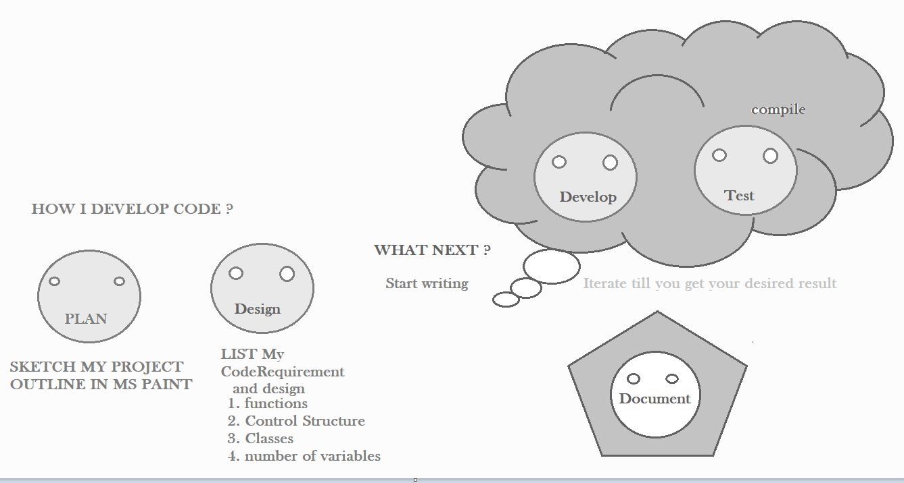

> # WELCOME TO MY GITHUB PAGE !

I have profound knowledge in ***Robotics and Software Development***. I develop contents for customized course and practical ideas for robot/embedded system projects. With my years of self-project experience, I can turn ideas into reality through software. 

**I like to code for Robots, Embedded system & for designing Websites**.I love exploring new ideas in science and I support the people who are onto exploration. I wish YOU all Great success in Your life . 

***

I will be contributing projects in 

- C++
- PYTHON
- ROS
- MICRO-CONTROLLERS - ARDUINO boards

Lets create some open source project !!! lets teach what we learn 

<!---
winnergetsyou/winnergetsyou is a ✨ special ✨ repository because its `README.md` (this file) appears on your GitHub profile.
You can click the Preview link to take a look at your changes.
--->

> # CLICK ME [My_NEW_UDEMY_COURSE](https://www.udemy.com/course/ros-basics-and-ros-arduino-interfacing/)

|course| ROS_Basics_Arduino_Interfacing
|--|--|
|content_1| ROS Basics 
|content_2|ROS Package program|
|content_3|Arduino interface Program|
|content_4|Interface Demo|

> *** 
> ***CLICK_ME [My_NEW_UDEMY_COURSE_ROS_Repo](https://github.com/winnergetsyou/COURSE_1_ROS_NODES.git)***
> ***
> ***CLICK_ME [My_NEW_UDEMY_COURSE_Arduino_Repo](https://github.com/winnergetsyou/Course_1_Arduino.git)***
> ***
> ***CLICK_ME [Internship_1_TSA](https://github.com/winnergetsyou/Course_1_Arduino.git)***
> ***
> ***CLICK_ME [NEW_Open_Source_Project-(ON-PROGRESS)](https://github.com/winnergetsyou/ROBOT_CAR.git)***
